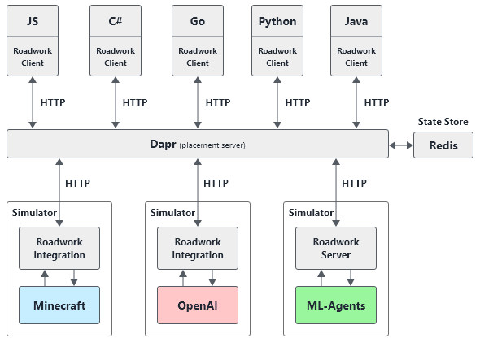

# Roadwork-RL through Dapr - Work in progress

## Architecture




## Installation

For fresh install the following steps were followed:

```bash
# 1. Dapr Install
wget -q https://raw.githubusercontent.com/dapr/cli/master/install/install.sh -O - | /bin/bash
> https://github.com/dapr/docs/blob/master/getting-started/environment-setup.md

sudo dapr init

# 2. Dapr Python install
git clone https://github.com/dapr/python-sdk.git
modify setup.cfg and change > 3.8 to > 3.7
pip install -e

# 3. Dependencies (Gym, Dapr Actor and Roadwork)
sudo apt-get install ffmpeg python-opengl xvfb
sudo pip3 install gym
sudo pip3 install flask
sudo pip3 install -r dev-requirements.txt # in src-dapr/
sudo pip3 install dapr

# 4. Install Roadwork Library
cd src/Lib/python/roadwork
sudo pip install -e .
```

## Running

You can now run an experiment, for that following these steps:

```bash
# 1. Start X Server for rendering
xvfb -screen 0 1024x768x24 &
export DISPLAY=:0

# 2. Navigate to Dapr Folder
cd src-dapr

# 3. Run Main Server (containing OpenAI)
sudo dapr run --app-id demo-actor --app-port 3000 python3 ./main.py

# 4. Run Experiment (in different window, also in src-dapr folder)
sudo dapr run --app-id demo-client python3 ./Experiments/baselines/cartpole/train.py
```

